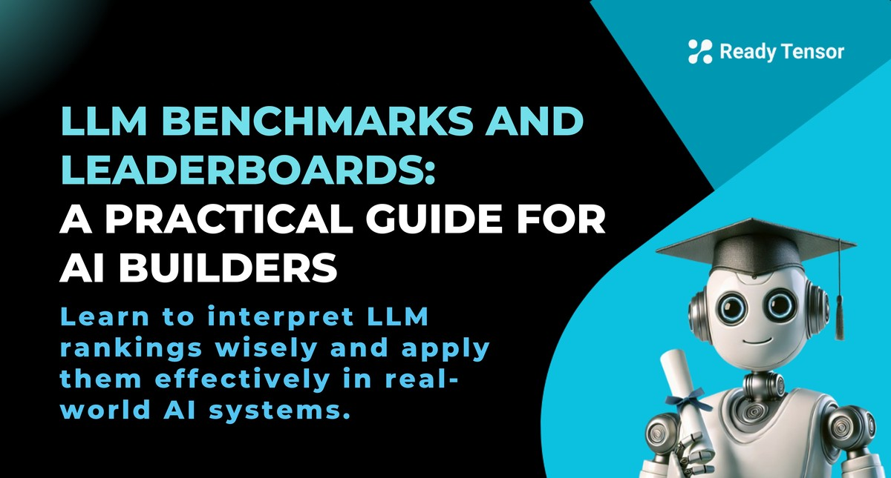
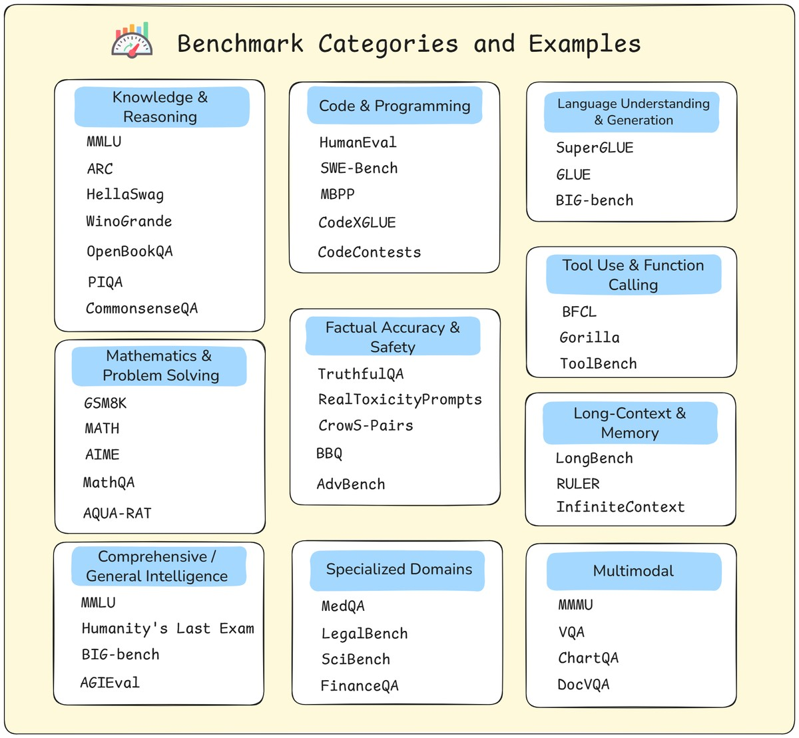
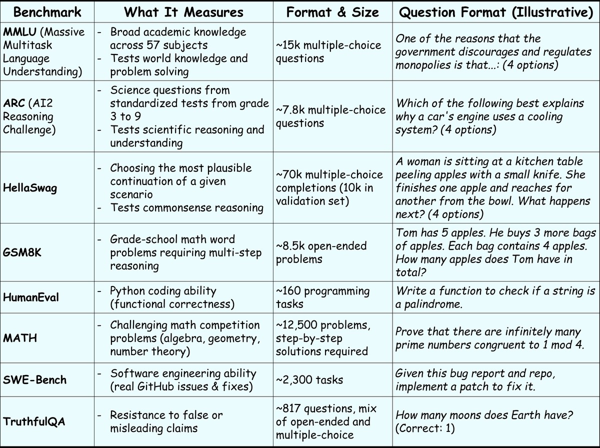
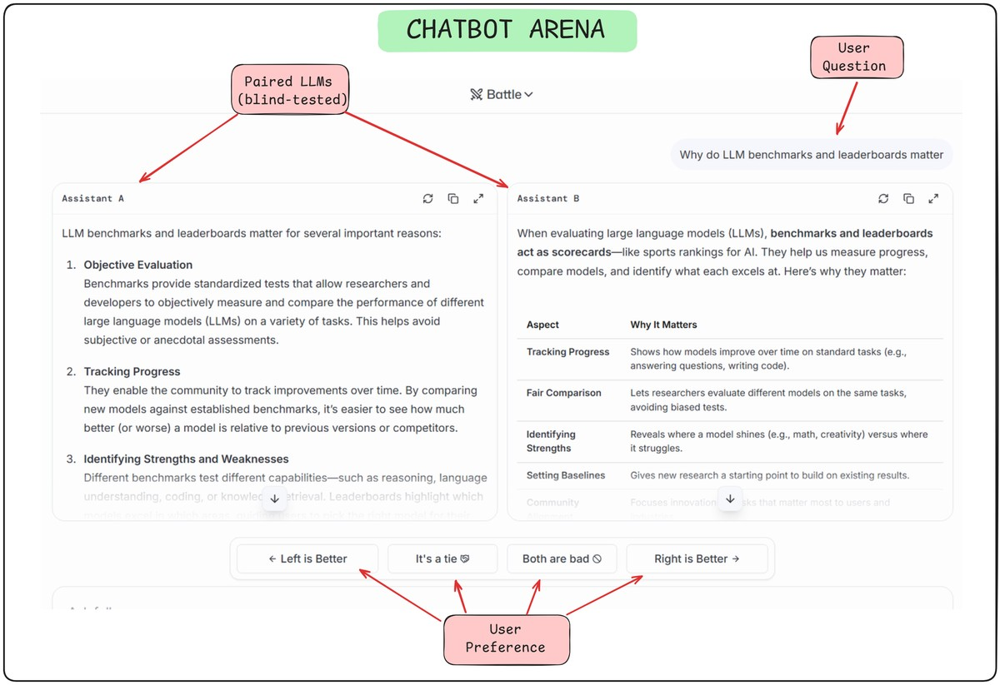
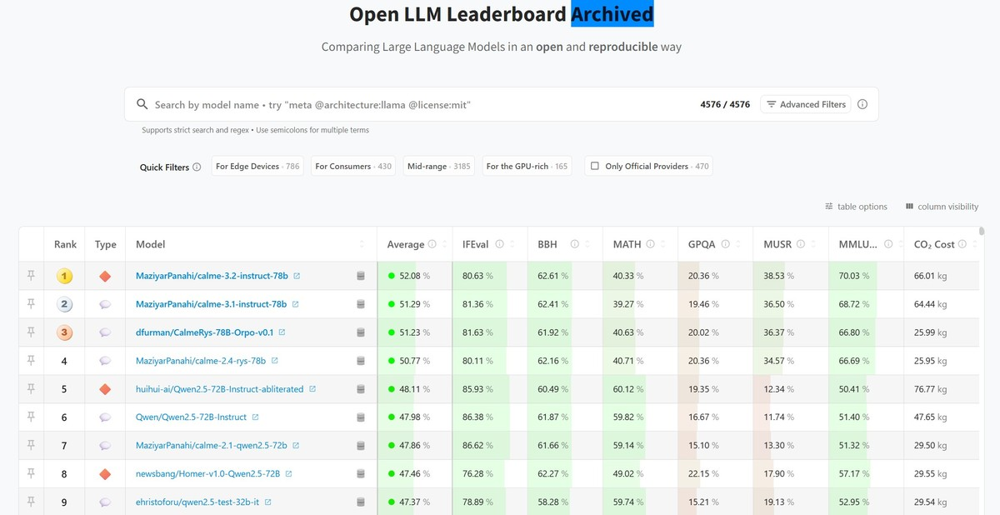
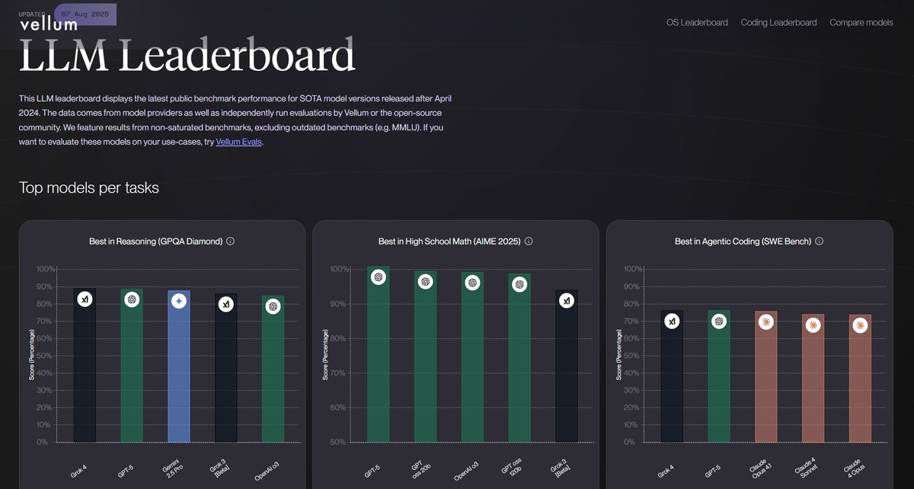

 <!-- RT_DIVIDER -->

---

[🏠 Home - All Lessons](https://app.readytensor.ai/hubs/ready_tensor_certifications)

---

 <!-- RT_DIVIDER -->

# TL;DR

LLM benchmarks and leaderboards are everywhere—but what do they really tell you? In this lesson, you’ll learn how to interpret benchmark scores, why human preference rankings like Chatbot Arena often tell a different story, and how to avoid being misled by hype or tiny score differences. Most importantly, you’ll see why leaderboards are helpful guides, but real progress comes from testing models in your own context.

---

 <!-- RT_DIVIDER -->

# Making Sense of LLM Benchmarks and Leaderboards

> _"Gemini just beat GPT-4 on MMLU!"_  
> _"LLaMA 3 is now #1 on Chatbot Arena!"_  
> _"Claude 3 Opus is crushing long-context tasks!"_

If you’ve seen headlines like these and wondered what they actually mean — you’re not alone.

LLM benchmarks and leaderboards are everywhere. They shape public perception, guide product decisions, and drive the open-source AI race. But they’re also easy to misunderstand.

In this lesson, we’ll walk you through how benchmarks and leaderboards actually work, what different evaluation platforms are really measuring, and how to read leaderboard results without being misled by hype or half-percent score differences.

You’ll learn why some models impress in human tests but struggle on academic benchmarks, how to choose the right model for your system—not just the highest-ranked one—and why your own evaluation pipeline will always matter more than a public leaderboard.

Whether you’re just exploring or actively building, the top-ranked model isn’t always the best one for your needs. To see why, we first need to unpack what these benchmarks actually are.

---

 <!-- RT_DIVIDER -->

# What Is an LLM Benchmark, Really?

At its core, a **benchmark** is just a test. A model is given a set of questions or tasks, its answers are compared against known solutions, and a score is assigned. The logic is simple: if every model takes the same test, you can compare results fairly.

But not all benchmarks measure the same thing. Some are **static tests** — fixed datasets that check for skills like reasoning, math, coding, or factual reliability. Others rely on **human preference** — asking people to judge which model _feels_ more useful, natural, or accurate in real interactions.

Even within static benchmarks, there’s a lot of variety. Some focus on broad academic knowledge, others on grade-school math word problems, software engineering tasks, or how well a model avoids repeating false information.

To make sense of this space, it helps to zoom out first. Let’s take a look at the broader landscape of benchmarks before narrowing in on a few of the most widely used ones.

---

 <!-- RT_DIVIDER -->

## The Benchmark Landscape

Benchmarks come in many flavors, each designed to test a different aspect of model ability. Some measure general reasoning, others dive into math or code, and still others focus on truthfulness, safety, or domain-specific knowledge. On top of that, new benchmarks are emerging rapidly in areas like tool use, long-context reasoning, and multimodal understanding.

To give you a sense of the ecosystem, here’s a categorized view of commonly used benchmarks across domains:

This broader view highlights three important points:

1.  **There are a lot of benchmarks!** The sheer number can feel overwhelming, and what you see here is only a sample and new ones are being developed all the time.
2.  **No single benchmark covers everything.** Each one is a slice of capability, not a full picture.
3.  **Benchmarks span a wide range of skills.** From math contests to coding tasks, from bias detection to multimodal reasoning, leaderboards mix together very different kinds of evaluations.

With so many benchmarks out there, it helps to focus on the ones you’ll see again and again. Let’s zoom in on a handful of the most widely used benchmarks that dominate leaderboards — and look at the kinds of questions they actually test.

---

 <!-- RT_DIVIDER -->

## A Closer Look at Common Benchmarks

Although the benchmark landscape is broad, a smaller core group shows up most often in leaderboards and research papers. These are the datasets practitioners rely on to get a quick read of a model’s strengths and weaknesses.

The table highlights common benchmarks, what they measure, their format, and an example task.

Looking across this table, two things stand out:

1.  **Different formats require different skills.** Some tests are multiple choice (MMLU, ARC), others need step-by-step reasoning (GSM8K, MATH), while others involve scenario completions (HellaSwag) or full program synthesis (HumanEval, SWE-Bench). This variety means benchmarks don’t just test _what_ a model knows, but _how_ it applies that knowledge.

2.  **Benchmarking is computationally expensive.** Many of these datasets contain thousands of examples, and running a large model across all of them can be time-consuming and costly. That’s why public leaderboards are so valuable — they centralize the effort and make results available to everyone.

---

 <!-- RT_DIVIDER -->

Static benchmarks are excellent at probing whether models can solve specific types of tasks, and as we've seen, running these comprehensive evaluations is computationally expensive. But there's something these standardized tests can't measure: **how a model actually feels to use**. That's where **human preference testing** comes in.

---

 <!-- RT_DIVIDER -->

## Human Preference Testing: Ranking by Feel

Static benchmarks tell us whether a model can pass structured tests at scale. But they don’t capture how the model actually **feels to use**. That’s where **human preference testing** comes in.

The most prominent example is **Chatbot Arena**, run by LMSYS. Instead of fixed test sets, it uses a simple but powerful setup: two anonymous model responses are shown side by side, and a human votes for the one they prefer. The model names are hidden, so judgments are based purely on output quality. Over time, thousands of these head-to-head votes accumulate into an **Elo rating** (the same system used in chess), producing a live ranking of models.

What this captures is very different from static tests:

- **Did it answer my question?**
- **Was it clear and easy to follow?**
- **Did it sound natural or robotic?**
- **Did it follow the instructions I gave?**

This explains why the rankings often diverge from static benchmarks. A model that doesn’t top MMLU may still win more votes in Chatbot Arena because its responses are clearer, more natural, or more engaging. Conversely, a technically strong model might drop votes if it feels stiff or overwhelming.

In short:

- **Static benchmarks** measure **competence** — knowledge, reasoning, accuracy.
- **Human preference tests** measure **perception** — how people experience quality in practice.

Both matter. Researchers use static benchmarks to track raw skills. Builders look to human preference results to anticipate how their users will actually experience the model.

> **🤔Reflection:** If you were choosing a model for your own AI Assistant project, which signal would you weigh more heavily — higher static benchmark scores, or consistently better user preference?

---

 <!-- RT_DIVIDER -->

# From Benchmarks to Leaderboards

Benchmarks give us scores, but what usually makes headlines is the **leaderboard**. A leaderboard is essentially a **scoreboard**: it aggregates results from multiple benchmarks and presents them as a single ranking of models.

This makes leaderboards incredibly appealing. Instead of digging through raw numbers, you get a clean, competitive snapshot of who’s “on top.” But that simplicity can also be misleading if you don’t know what’s behind the number.

We’ve already looked at **Chatbot Arena**, which layers a leaderboard view on top of human preference testing. Now let’s turn to two other widely referenced examples: the **Hugging Face Open LLM Leaderboard** and **Vellum**.

 <!-- RT_DIVIDER -->

## Hugging Face Open LLM Leaderboard

 
<em>Hugging Face Open LLM Leaderboard (Aug. 26th, 2025)</em>

 
   - Aggregates static benchmarks like MMLU, ARC, HellaSwag, and TruthfulQA.
   - Reports an overall score alongside individual benchmark breakdowns.
   - Strong emphasis on open-source models, with evaluations run through a standardized automated harness.
 
 
 
 <!-- RT_DIVIDER -->
 ## Vellum
 
 
 
<em>Vellum Public Leaderboard (Aug. 26th, 2025)</em>

 
 Vellum maintains a public leaderboard that tracks state-of-the-art models on newer, non-saturated benchmarks, combining results from model providers, community runs, and its own evaluations. It deliberately avoids saturated benchmarks like MMLU, focusing instead on fresher indicators of performance. At the same time, Vellum also offers **custom evals**, letting teams benchmark models directly on their own workflows. This makes it both a source of public performance data and a tool for organizations to identify which model works best in production.
 
 ---
 
 <!-- RT_DIVIDER -->
 
 Whether public like Hugging Face, community-driven like Arena, or enterprise-focused like Vellum, leaderboards give you a snapshot — but not the full story. Let’s explore how to use them more effectively.
 
 ---
 <!-- RT_DIVIDER -->
 
 # How to Use Leaderboards Wisely
 
 Leaderboards are powerful, but only if you know how to interpret them. It’s easy to get dazzled by a top-ranked model or misled by small score differences. Instead of treating them as a horse race, think of them as a filtering tool — a way to narrow your options before doing deeper, workflow-specific testing.
 
 When selecting models, developers can employ a structured decision checklist to shortlist candidates effectively:
 
 **1. Start with the overall score — but don’t stop there** 
 The average score gives you a quick sense of general capability. It’s a good starting point, but not the whole story.
 
 **2.  Look at the breakdown by task** 
 Dig into the individual benchmark scores. Building a RAG system that needs to avoid hallucinations? Prioritize TruthfulQA. Developing an agent that needs to reason through complex steps? Look at scores on reasoning and math benchmarks.
 
  **3. Factor in deployment realities** 
 Beyond raw performance, practical constraints are vital.
 This includes assessing the model's parameter count, its maximum context length, and its expected inference latency. These factors directly influence the computational resources required and the responsiveness of the deployed system.
 
  **4. Check availability and licensing** 
 Don’t forget the boring but important stuff: can you actually use the model? Is it on Hugging Face or behind an API? Does the license let you deploy it commercially?
 
 **5. Run your own evaluations**
 Finally, no leaderboard can replace testing in your own environment. Use custom evals with your data and workflows to see how the model performs in practice.
 
 ---
 
 <!-- RT_DIVIDER -->
 :::info{title="Example"}
 
 <h2> A Practical Example </h2>
 
 Imagine building an agentic customer support bot. 
 
 On the Hugging Face leaderboard, the top-ranked model is a massive 70B parameter system with a stellar average score. But when you dig into the breakdown, you notice it struggles on TruthfulQA — a red flag for an assistant that needs to stay factually accurate. You also realize its size makes it impractical to run in your setup.
 
 Instead, you shortlist a smaller 13B model that ranks lower overall but performs strongly on TruthfulQA and MMLU. You run it through your own custom evaluation pipeline with your research documents and confirm it meets your needs at a fraction of the cost.
 
 That’s the key: **the best model isn’t always the top-ranked one — it’s the one that fits your use case.**
 
 :::
 
 ---
 
 
 <!-- RT_DIVIDER -->
 
 # Leaderboard Pitfalls to Avoid
 
 Leaderboards are powerful tools, but they must be used with caution. A few cautions to keep in mind:
 
 - **The Benchmark-to-Reality Gap:** Scores don't capture qualitative aspects like tone, creativity, or how well a model integrates into a larger system (e.g., with APIs and other tools).
 
 - **Benchmark-Fitting:** There is a growing risk of models being over-optimized to excel on benchmark tests, which may not translate to generalized, real-world intelligence.
 
 - **Unmeasured Variables:** Critical business metrics like latency, cost-per-token, memory footprint, and compliance with safety constraints are not reflected in leaderboard scores.
 
 - **Reading Small Deltas as Significant:** A difference of 0.5% on an average score between two models is often statistical noise, not a meaningful signal of superiority. Avoid declaring a "new state-of-the-art" based on trivial score differences.
 
 Used wisely, leaderboards can point you to promising models. Used carelessly, they can send you chasing hype.
 
 ---
 <!-- RT_DIVIDER -->
 
 # Beyond Benchmarks: What Really Matters
 
 Leaderboards can tell you which base model looks strongest on standardized tests. But if you’re building agentic systems, that’s only a small part of the story.
 
 What really determines success is how the model performs inside your workflow, with your data, and in the context of your system design. A leaderboard can’t measure that.
 
 Here’s why:
 
 - **Prompt engineering matters.** The same model can perform poorly or brilliantly depending on how you structure instructions, roles, and constraints.
 - **Grounding matters.** Retrieval-Augmented Generation (RAG) pipelines can make a smaller model outperform a bigger one by keeping it anchored to the right knowledge.
 - **System design matters.** Multi-agent setups, reflection loops, or supervisor–worker architectures often matter more than squeezing out a 0.5% leaderboard gain.
 - **Software engineering matters.** Monitoring, error handling, and resilience turn an agentic system using a smaller language model into a reliable product.
 
 Looking ahead, evaluation itself is evolving. The most forward-thinking teams are moving beyond static benchmarks toward **holistic, system-level tests** that mirror real-world applications. These include:
 
 - **RAG grounding** — does the model stick to provided documents instead of hallucinating?
 - **Tool-use success** — can it call APIs or external tools reliably?
 - **Recovery from failure** — how gracefully does it handle errors and ambiguity?
 - **Multi-agent performance** — can multiple agents collaborate effectively to solve complex tasks?
 
 The lesson is simple: even the best, biggest LLM can fail in a poorly designed system, while a smaller, cheaper one can succeed with thoughtful engineering.
 
 👉 Key takeaway: **Don’t chase leaderboard glory — build systems that win in practice.**
 
 
 
 <!-- RT_DIVIDER -->
 
 ---
 
 [🏠 Home - All Lessons](https://app.readytensor.ai/hubs/ready_tensor_certifications)  
 
 ---
